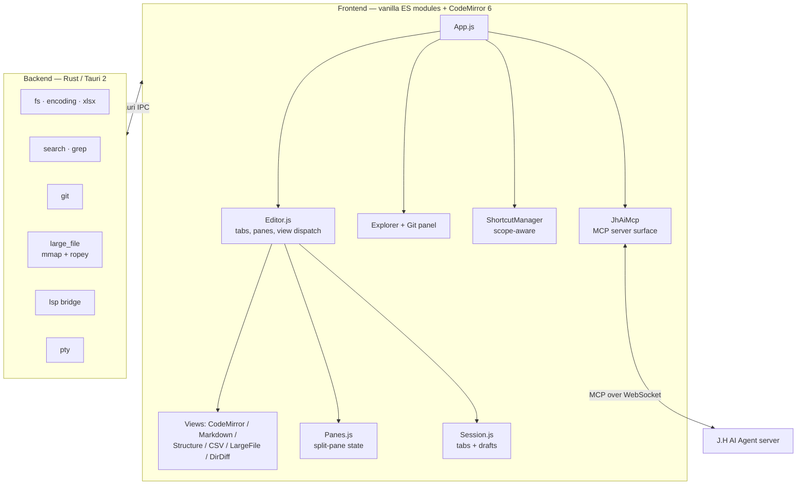

# J.H Editor

A local-first desktop text editor built with **Tauri 2**, **vanilla JavaScript** and **CodeMirror 6**.

J.H Editor is aimed at being the editor you leave open all day — a fast default for
plain text and **Markdown**, with structured-data tools (CSV / JSON / XML / HTML) and a
Git panel when you need them. It is not trying to be an IDE. Where AI is concerned it
plays the **companion** role: it exposes the document you are editing to an external
agent over MCP, rather than embedding an LLM stack of its own.

---

## ✨ Features

### 📝 Editing modes

Every file opens in **Text** mode by default (CSV opens as a table). `Ctrl+Shift+E`
switches modes; the current mode is always shown in the status bar.

| Mode | What it is |
|------|-----------|
| **Text** | CodeMirror 6 with per-language syntax highlighting, bracket & selected-word matching, whitespace markers, code folding, word wrap, and a scrollbar minimap of search hits |
| **Markdown (block)** | Notion-style block editing. Double-click or `F2` opens a large split modal — source on the left, live preview on the right |
| **Structure** | Tree + source dual pane for JSON / XML / HTML / JSP, with drag-and-drop node manipulation |
| **Table (CSV/TSV)** | Spreadsheet-style grid: virtual scrolling, row/column select, resize, sort, transpose, Excel-style insert/delete keys |
| **Diff** | Side-by-side diff with per-hunk Accept/Reject, whitespace-ignore toggle, similarity-based line pairing, and a change minimap |
| **Book** | Page-turning reading view (`Ctrl+Alt+B`) for long documents, with syntax highlighting intact |

### ✍️ Markdown

- **Live split preview** in the block edit modal
- **Mermaid** diagrams, with a **recipe helper** — pick a diagram type (sequence, flowchart,
  class, ER, state, gantt, mindmap, …) instead of re-reading the syntax every time
- **KaTeX** math, `[[WikiLinks]]` with backlink lookup, and **PDF export**
- **Paste or drop an image** — it is saved next to the document and linked relatively
- Click any diagram or image to open it full-size in a lightbox
- Reusable document **templates**

### 🗂️ Files & search

- **Explorer** — virtual-scrolled tree, filter box, drag-and-drop, multi-workspace, "Reveal in File Explorer"
- **Workspace grep** (`Ctrl+G`) with **glob filters** (`*.java`), opening into its own results tab
- **File search** (`Ctrl+P`), **tab search** (`Ctrl+T`), **outline** (`Ctrl+O`), **go to line** (`Ctrl+L`)
- **Compare** two files from the explorer, or two whole **folders** (recursive: differing files
  open as a diff, files present on only one side are marked `+` / `-`)
- **Huge files** — beyond a threshold, files open through a Rust `mmap` backend that serves
  only the visible lines; editing uses a `ropey`-backed sliding window, so a 100 MB log
  neither freezes the UI nor gets pulled into JS memory
- **Encoding** — auto-detection (`chardetng`) plus manual override (UTF-8, Shift-JIS, EUC-JP, …),
  and explicit CRLF/LF control that never changes on its own
- **Excel → Markdown** — `.xlsx` sheets are read via `calamine` and rendered as tables

### 🪟 Window & session

- **Split editor** (`Ctrl+\`) with draggable tabs between panes, and drag-to-split
- **Session restore** — open tabs, active tab, split layout and scroll position come back
- **Draft recovery** — unsaved buffer text is persisted separately and restored after a crash
- **HTML preview** — for `.html` files, a side-by-side preview. Scripts are **off** by default;
  relative CSS/images resolve because their URLs are rewritten to absolute asset URLs

### 🐙 Git

- **Status panel** — branch selector, stage/unstage, commit, push/pull/fetch
- **Diff against HEAD** for modified, added and deleted files
- **History graph** — commit list with search, per-commit file lists, two-revision comparison,
  and working-tree ↔ commit comparison
- Status badges: `M` modified · `U` untracked · `D` deleted · `S` staged

### 🤖 AI (J.H AI Agent integration)

J.H Editor does **not** ship an LLM, embeddings, or a vector index. It connects to the
sibling **[J.H AI Agent](../jh-ai-agent)** server and acts as an **MCP server toward it** —
the agent's model calls back into the editor for context.

- **Tools exposed to the agent** — `get_buffer`, `get_selection`, `list_open_files`,
  `read_workspace_file`, `list_workspace_files`, `get_diagnostics`
- **Intents** — named actions (`summarize_logs`, `explain_selection`, and a free-prompt mode
  where the model picks its own tools)
- **Inline AI** (`Ctrl+Space`) — Explain / Refactor / Add Types / Error Handling / To Code.
  Rewrites come back as a **diff you review and apply**, never as a silent buffer edit
- **Activity dock** — live task status with a Stop button
- **Zero-setup connection** — reads the connection file J.H AI Agent's "Export Connection"
  writes (`%APPDATA%/JH/ai-connection.json` and platform equivalents), with manual
  URL/token override in Settings

### 🧭 Language support

- **LSP** — `rust-analyzer` and `typescript-language-server` (completion, hover, diagnostics,
  Go to Definition `F12`, Find References `Shift+F12`). A status-bar warning appears when a
  server is configured but not installed; nothing is auto-installed
- **Vim mode** (`Ctrl+Alt+V`) via `@replit/codemirror-vim`

### 🎨 Customization

- **11 themes** — Light, Dark, Midnight, Latte, Solarized Light, Solarized Dark, Paper, Bamboo Slip, Ink Brush, Nord, Hanging Scroll
- **Fonts** — separate family/size for editor, UI and terminal
- **Shortcuts** — scope-aware system with a searchable in-app guide (`F1`)
- **Integrated terminal** — xterm.js over a native PTY (toggled from the title bar)

---

## 🏗️ Architecture



### Design principles

- **No frontend framework** — plain ES modules with explicit DOM updates
- **Singleton state** — a small `Store.js`; pane/session logic is factored into pure,
  testable modules (`Panes.js`, `Session.js`) rather than living inside the DOM code
- **Rust-first I/O** — file access, encoding detection, grep, git and huge-file handling
  all happen in Rust
- **The editor is the context source, not the brain** — AI capability comes from the
  agent it connects to; the editor's job is to expose the document accurately and to
  make every AI edit reviewable

---

## 🚀 Getting started

### Prerequisites

- [Node.js](https://nodejs.org/) v18+
- [Rust](https://rustup.rs/) (latest stable)
- [Tauri CLI](https://tauri.app/start/) v2

> The `@jh/ai-client` dependency is resolved from `../jh-ai-agent/packages/jh-ai-client`.
> Check out both repositories side by side, or the install will fail.

```sh
npm install

# Development (Tauri shell + Vite HMR)
npm run tauri dev

# Production build
npm run tauri build
```

### Testing

```sh
# Unit tests (vitest, jsdom)
npm test

# With coverage — thresholds are checked when run with coverage
npm run test:coverage
```

Coverage thresholds (90% statements / lines / functions, 85% branches) apply to
the **logic** layer (utils, `Store`, `Session`, `Panes`, `ShortcutManager`,
`PluginManager`) and are enforced by `npm run test:coverage` — `npm test` runs the
unit suite without the coverage gate. Views and editors are driven by real
widgets; they are covered by the Playwright suite in `tests/e2e/`, which verifies
UI wiring that runs in a plain browser (settings/theme switching, new-file and
shortcut-guide modals).

### Recommended IDE setup

[VS Code](https://code.visualstudio.com/) + [Tauri](https://marketplace.visualstudio.com/items?itemName=tauri-apps.tauri-vscode) + [rust-analyzer](https://marketplace.visualstudio.com/items?itemName=rust-lang.rust-analyzer)

---

## 📁 Project structure

```
jh-editor/
├── src/
│   ├── modules/
│   │   ├── ai/            # JhAiMcp (MCP surface), jhai-adapter, activity dock
│   │   ├── core/          # App, Editor, Panes, Session, Store, Explorer, shortcuts
│   │   ├── editors/       # Csv, Diff, Structure, Table, Compare, Vim
│   │   ├── lsp/           # LspClient, completion / hover / diagnostics widgets
│   │   ├── ui/            # Modals, Git panel, search, terminal, HTML preview, Mermaid helper
│   │   ├── utils/         # Parsers, highlighters, Markdown, VirtualScroll, FileSystem
│   │   ├── views/         # CodeMirror, Markdown, Structure, Csv, LargeFile, DirDiff
│   │   └── workers/       # CSV / parser / formatter web workers
│   └── styles/            # Themes and component CSS
├── src-tauri/
│   └── src/commands/      # fs, search, git, large_file, lsp, parser, pty, app, window
├── docs/                  # Per-module reference docs (ja / en)
└── tests/                 # vitest unit tests + tests/e2e (Playwright)
```

---

## ⌨️ Key shortcuts

Press **`F1`** (or `Ctrl+/`) for the searchable in-app guide — it is generated from the same
definitions the app dispatches, so it cannot drift out of date.

| Shortcut | Action |
|----------|--------|
| `F1` / `Ctrl+/` | Shortcut guide |
| `Ctrl+S` | Save |
| `Ctrl+N` / `Ctrl+W` | New file / Close tab |
| `Ctrl+Tab` / `Ctrl+Shift+Tab` | Next / previous tab |
| `Ctrl+P` | File search |
| `Ctrl+T` | Tab search |
| `Ctrl+G` | Workspace grep (supports globs) |
| `Ctrl+F` | Search in file |
| `F3` / `Shift+F3` | Find next / previous |
| `Ctrl+L` / `Ctrl+O` | Go to line / Outline |
| `Ctrl+Shift+E` | Toggle view mode (Text ⇄ Structure / Table / Markdown) |
| `Ctrl+Alt+P` | Toggle preview (Markdown / HTML) |
| `Ctrl+Alt+B` | Book mode |
| `Ctrl+\` | Split editor right |
| `Ctrl+Shift+\` | Focus other pane |
| `Ctrl+Shift+W` | Close split |
| `Ctrl+Shift+D` / `Ctrl+Alt+D` | Compare with file / Compare scratch text |
| `Ctrl+Space` | Inline AI |
| `F12` / `Shift+F12` | Go to definition / Find references |
| `Ctrl+Alt+V` | Vim mode |
| `Ctrl+Alt+W` | Whitespace markers |
| `Shift+Alt+F` | Format |
| `Ctrl+1` / `Ctrl+2` | Focus explorer / editor |
| `F2` | Edit Markdown block · rename in explorer · edit CSV cell |

---

## 📚 Documentation

Per-file reference docs (methods and branches) live under `docs/`, in Japanese and English.

| Module | 日本語 | English |
|--------|--------|---------|
| Core | [docs/ja/core/](docs/ja/core/README.md) | [docs/en/core/](docs/en/core/README.md) |
| AI | [docs/ja/ai/](docs/ja/ai/README.md) | [docs/en/ai/](docs/en/ai/README.md) |
| Editors | [docs/ja/editors/](docs/ja/editors/README.md) | [docs/en/editors/](docs/en/editors/README.md) |
| UI | [docs/ja/ui/](docs/ja/ui/README.md) | [docs/en/ui/](docs/en/ui/README.md) |
| LSP | [docs/ja/lsp/](docs/ja/lsp/README.md) | [docs/en/lsp/](docs/en/lsp/README.md) |
| Utils | [docs/ja/utils/](docs/ja/utils/README.md) | [docs/en/utils/](docs/en/utils/README.md) |
| Views | [docs/ja/views/](docs/ja/views/README.md) | [docs/en/views/](docs/en/views/README.md) |
| Workers | [docs/ja/workers/](docs/ja/workers/README.md) | [docs/en/workers/](docs/en/workers/README.md) |
| Backend | [docs/ja/backend/](docs/ja/backend/README.md) | [docs/en/backend/](docs/en/backend/README.md) |

> These docs trail the source. Modules added recently — `Panes.js`, `Session.js`,
> `HtmlPreview.js`, `DirDiffView.js`, `MermaidHelper.js`, `SearchResultsView.js` — are not
> covered yet.

For cutting a build — version bumping, signing, and wiring automatic updates —
see **[docs/RELEASE.md](docs/RELEASE.md)**.

---

## 🔒 Rendering untrusted documents

Opening a file is not consent to run what is inside it. Markdown permits raw
HTML and `marked` passes it through, so everything rendered from document text
goes through `utils/SanitizeHtml.js` before it reaches the DOM — script tags,
event-handler attributes and `javascript:` URLs are removed, while tables, task
lists, code highlighting, images and Mermaid blocks are kept. Mermaid runs at
`securityLevel: 'strict'`, so a diagram's `click` directive cannot call into the
page. HTML files preview inside a sandboxed iframe with scripts off by default.

Git runs through `git_exec`, which takes an argument array — there is no general
shell command reachable from the webview.

---

## 📄 License

MIT — see [LICENSE](LICENSE).
