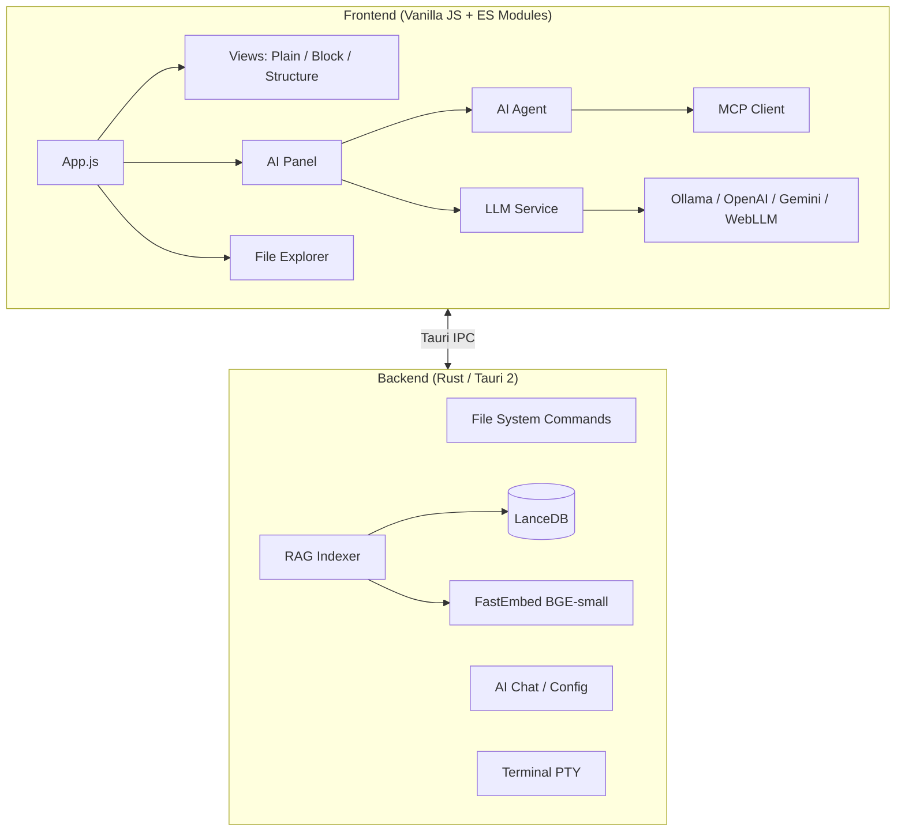

# J.H Editor

A local-first, AI-powered code editor built with **Tauri 2** and **Vanilla JavaScript**.  
Combines lightweight editing with an integrated AI agent, semantic search (RAG), and structured data tools — all running natively on your desktop.

---

## ✨ Key Features

### 🤖 AI Integration

- **AI Agent Mode** — Autonomous tool-calling agent that can read/write files, search your project, and execute shell commands with human-in-the-loop confirmation
- **Inline AI** (Ctrl+Space) — Context-aware code suggestions directly in the editor
- **Multi-Provider Support** — Ollama (local), OpenAI, Google Gemini, Azure OpenAI, or any OpenAI-compatible API
- **WebLLM** — Run LLMs entirely in-browser via WebGPU (Gemma, Phi, Llama) — no server required
- **MCP (Model Context Protocol)** — Extend the agent with external tool servers
- **SKILLS & Workflow Extraction** — AI-powered project context analysis and repeatable workflow automation

### 🔍 RAG (Retrieval-Augmented Generation)

- **Semantic Search** — Index your entire project with vector embeddings (LanceDB + FastEmbed BGE-small)
- **Smart Chunking** — Language-aware code splitting at function/class boundaries for high-quality retrieval
- **Privacy-First** — All indexing runs locally in Rust. Project-level approval controls which directories are indexed
- **Configurable Exclusions** — Fine-grained control over indexed directories and file extensions

### 📝 Multi-Mode Editor

| Mode | Description |
|------|-------------|
| **Plain Text** | Line numbers, syntax highlighting (150+ languages via highlight.js), regex search/replace, EOL visualization |
| **Block (Markdown)** | Notion-style block editing with instant preview, Mermaid diagrams, and visual table editor |
| **Structure View** | Tree + source dual-pane editor for JSON, XML, and HTML with drag-and-drop node manipulation |
| **CSV Editor** | Spreadsheet-style editing with virtual scrolling, column/row resize, sort, transpose, and context menus |
| **Diff Editor** | Side-by-side diff with hunk-based Accept/Reject workflow (integrated with AI agent) |

### 🛠️ Developer Tools

- **File Explorer** — Virtual-scrolled tree with search filter, drag-and-drop, workspace management. Scroll-stable rendering (no duplicated rows when scrolling)
- **Integrated Terminal** — xterm.js + native PTY via Rust backend
- **Go to Definition** — Ctrl+Click navigation for imports and file references
- **Word & Bracket Highlighting** — Real-time matching across the editor
- **Multi-Encoding Support** — Auto-detection + manual switch (UTF-8, Shift-JIS, EUC-JP, etc.) via chardetng
- **VIM Mode** — Experimental modal editing support

### 🐙 Git Integration

- **Status Panel** — Branch selector, stage/unstage, commit, push/pull/fetch in the explorer sidebar
- **Diff View** — Click any changed file to open a side-by-side diff against HEAD (works for modified, added, and **deleted** files)
- **Untracked Folders** — New directories are listed file-by-file and expandable as tree nodes
- **Clear Status Badges** — `M` (modified, yellow), `U` (new/untracked, green), `D` (deleted, red with strikethrough), `S` (staged) with hover tooltips
- **History Graph** — Commit graph with search, per-commit file lists, and two-revision comparisons (Shift+click or context menu)

### 🎨 Customization

- **4 Themes** — Dark, Light, Midnight, Latte (CSS variable-based, easily extensible)
- **Font Settings** — Configurable font family and size for editor, UI, and terminal
- **Keyboard Shortcuts** — Fully customizable, scope-aware shortcut system
- **Proxy Support** — SOCKS5 and HTTP proxy for AI API connections

---

## 🏗️ Architecture



### Design Principles

- **No Frontend Framework** — Pure ES Modules with explicit DOM updates for minimal overhead
- **Singleton State** — Lightweight `Store.js` for global state management
- **Rust-First I/O** — All file operations, embedding, and LLM proxy handled in Rust for performance and security
- **Local-First AI** — API keys stored securely in Rust backend; full offline capability with Ollama/WebLLM

---

## 🚀 Getting Started

### Prerequisites

- [Node.js](https://nodejs.org/) (v18+)
- [Rust](https://rustup.rs/) (latest stable)
- [Tauri CLI](https://tauri.app/start/) v2

### Setup

```sh
# Install dependencies
npm install

# Run in development mode
npm run tauri dev

# Build for production
npm run tauri build
```

### Recommended IDE Setup

- [VS Code](https://code.visualstudio.com/) + [Tauri Extension](https://marketplace.visualstudio.com/items?itemName=tauri-apps.tauri-vscode) + [rust-analyzer](https://marketplace.visualstudio.com/items?itemName=rust-lang.rust-analyzer)

---

## 📁 Project Structure

```
jh-editor/
├── src/                          # Frontend source
│   ├── modules/
│   │   ├── ai/                   # AI Agent, LLM Service, MCP, Panel
│   │   ├── core/                 # App, Store, Editor, Shortcuts
│   │   ├── editors/              # CSV, Diff, Structure editors
│   │   ├── ui/                   # Settings, InlineAI, ContextMenu
│   │   ├── utils/                # Parsers, VirtualScroll, Navigation
│   │   └── views/                # PlainText, Block, Structure views
│   └── styles/                   # Theme & component CSS
├── src-tauri/                    # Rust backend
│   └── src/
│       ├── commands/             # Tauri commands (fs, ai, indexer, pty, etc.)
│       └── models/               # Data models
├── docs/                         # Documentation
└── tests/                        # Playwright E2E tests
```

---

## ⌨️ Key Shortcuts

| Shortcut | Action |
|----------|--------|
| `Ctrl+Shift+A` | Toggle AI Panel |
| `Ctrl+Space` | Inline AI (in editor) |
| `Ctrl+T` | Quick Tab Search |
| `Ctrl+S` | Save |
| `Ctrl+Shift+F` | Search in Files |
| `Ctrl+M` | Toggle View Mode (Plain ↔ Block) |
| `Ctrl+`` ` | Toggle Terminal |

---

## 📚 Documentation

ソースコードのメソッド・分岐単位の詳細ドキュメントが`docs/`配下に日本語/英語で整理されています。

### 日本語ドキュメント

| モジュール | パス | ファイル数 | 説明 |
|-----------|------|-----------|------|
| コア | [docs/ja/core/](docs/ja/core/README.md) | 10 | App, Editor, Explorer, Store, Shortcuts等 |
| AI | [docs/ja/ai/](docs/ja/ai/README.md) | 6 | AIAgent, JhAiMcp, ConnectionConfig等 |
| エディタ | [docs/ja/editors/](docs/ja/editors/README.md) | 6 | CsvEditor, DiffEditor, StructureEditor等 |
| UI | [docs/ja/ui/](docs/ja/ui/README.md) | 15 | GitPanel, Search, SettingsModal等 |
| LSP | [docs/ja/lsp/](docs/ja/lsp/README.md) | 4 | LspClient, CompletionWidget等 |
| ユーティリティ | [docs/ja/utils/](docs/ja/utils/README.md) | 16 | FileSystem, Navigation, Parsers等 |
| ビュー | [docs/ja/views/](docs/ja/views/README.md) | 7 | CodeMirrorView, MarkdownView等 |
| ワーカー | [docs/ja/workers/](docs/ja/workers/README.md) | 3 | CSV/Code/Parser Worker |
| バックエンド | [docs/ja/backend/](docs/ja/backend/README.md) | 14 | Rust/Tauriコマンド |

### English Documentation

| Module | Path | Files | Description |
|--------|------|-------|-------------|
| Core | [docs/en/core/](docs/en/core/README.md) | 10 | App, Editor, Explorer, Store, Shortcuts |
| AI | [docs/en/ai/](docs/en/ai/README.md) | 6 | AIAgent, JhAiMcp, ConnectionConfig |
| Editors | [docs/en/editors/](docs/en/editors/README.md) | 6 | CsvEditor, DiffEditor, StructureEditor |
| UI | [docs/en/ui/](docs/en/ui/README.md) | 15 | GitPanel, Search, SettingsModal |
| LSP | [docs/en/lsp/](docs/en/lsp/README.md) | 4 | LspClient, CompletionWidget |
| Utils | [docs/en/utils/](docs/en/utils/README.md) | 16 | FileSystem, Navigation, Parsers |
| Views | [docs/en/views/](docs/en/views/README.md) | 7 | CodeMirrorView, MarkdownView |
| Workers | [docs/en/workers/](docs/en/workers/README.md) | 3 | CSV/Code/Parser Worker |
| Backend | [docs/en/backend/](docs/en/backend/README.md) | 14 | Rust/Tauri commands |

---

## 📄 License

This project is licensed under the MIT License — see the [LICENSE](LICENSE) file for details.
